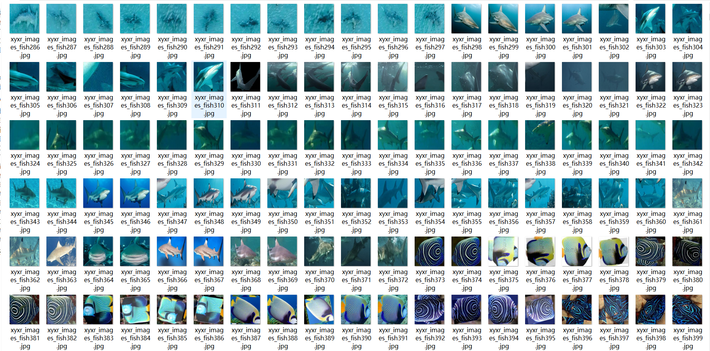
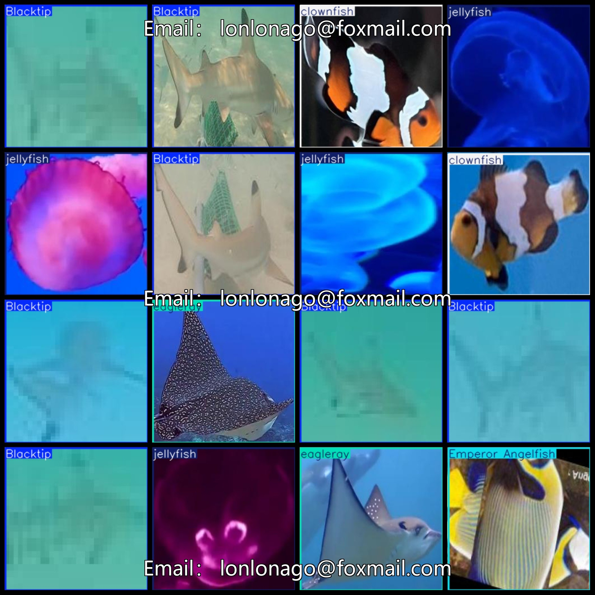

# [Object Detection] 5 typesSea Ocean Fish Type Dataset 18767 imagesYOLO+VOC format

【Target Detection】5 Types of Marine Fish Datasets with 18,767 Images in YOLO+VOC Format

Dataset Format: VOC format + YOLO format

The compressed file contains: three folders, each storing images, xml files, and text files.

Total jpg images in JPEGImages folder: 18767

The total number of XML files in the Annotations folder is 18,767.

The total number of txt files in the labels folder is 18767.

Number of tag types: 5

Tag names: ["Blacktip","Emperor Angelfish","clownfish","eagleray","jellyfish"]

[ "Blacktip shark", "Angelfish", "Clownfish", "Oarfish", "Sea Anemone"]

The number of boxes for each label (Note that the order of labels in the Yolo format does not correspond to this, but is based on the classes.txt file in the labels folder):

Blacktip frame count = 5085

Emperor Angelfish frame count = 1700

clownfish frame count = 2931

eagleray frame count = 2812

jellyfish frame count = 6239

Total boxes: 18767

Picture clarity (Resolution: Pixels): Clear

Is the image enhanced: No

Shape of the label: Rectangular box, used for object detection and recognition.

Important Note: None

Special Notice: This dataset does not guarantee the accuracy or precision of the trained models or weight files. The dataset only provides accurate and reasonable annotations.

## Images

---

Here is a pay link on Stripe (https://buy.stripe.com/3cs8yP7sY87d0vu9AB). Please contact me lonlonago@foxmail.com after funding $89, and I will send you a complete data files, thank you!

